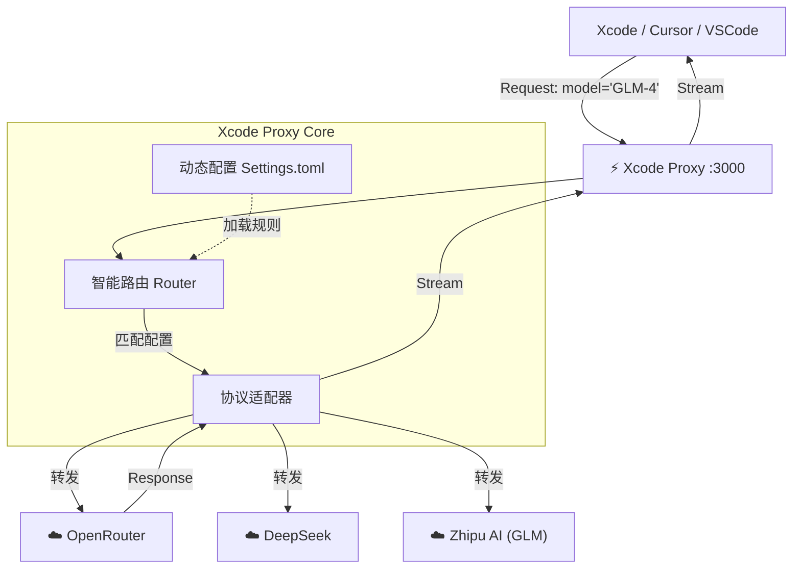

# Xcode Proxy (xcode-proxy)

[English](./README_EN.md) | [中文](./README.md)

**Xcode Proxy** 是一个专为 Xcode 设计的轻量级、高性能 AI 代理服务器。它充当了 Xcode 与现代 AI 模型之间的「万能适配器」。


它的核心目标是 **解锁** 与 **连接**：让封闭的 Xcode 开发生态能够无缝对接 OpenRouter、DeepSeek、Anthropic 等任何强大的 AI 服务。

<video src="assets/demo.mov" controls="controls" style="max-width: 100%;">
  <a href="assets/demo.mov">Watch Demo Video</a>
</video>


---

## 🏗 设计理念 & 核心架构

### Why Xcode Proxy?

Xcode 的 AI 功能（如 Copilot）通常被限制在特定的服务商范围内。开发者想要使用更便宜、更聪明或更合规的模型时，往往束手无策。

**Xcode Proxy 的设计哲学：**

1.  **Invisible (隐形)**：对 Xcode 来说，它就是一个标准的 OpenAI/Copilot 服务，无需 Hack Xcode 本身。
2.  **Universal (通用)**：只要是兼容 OpenAI 接口标准的服务，皆可接入。
3.  **Dynamic (动态)**：配置即生效。无需重启编译，修改 `settings.toml` 即可实时切换模型路由。
4.  **Resilient (弹性)**：自动处理认证、错误透传，并提供智能的默认配置兜底。

### 架构原理 (Architecture)



---

## 🚀 快速开始

### 1. 安装 (推荐)

您可以将本项目作为 Python 包安装，这样可以在任何地方使用 `xcode-proxy` 命令。

```bash
# 在项目根目录执行
pip install .

# 或者使用开发模式 (推荐开发者使用)
pip install -e .
```

### 2. 启动服务

安装后，直接在终端运行：

```bash
xcode-proxy
```

或者自定义端口：
```bash
xcode-proxy --port 8080
```

如果您未安装包，也可以直接运行脚本：
```bash
python app/cli.py
```

---

## ⚙️ 配置指南 (`settings.toml`)

项目使用 `settings.toml` 进行配置，所见即所得。

```toml
[server]
host = "0.0.0.0"   # 监听地址
port = 3000        # 服务端口

[server.models]
default = "GLM-4.7" # 默认模型（当客户端未指定模型时使用）

# --- 自定义模型配置 ---

# 1. 智谱 AI
[models.GLM-4]
type = "zhipu"
api_key = "your-api-key"

# 2. OpenRouter (接入全球模型)
[models."openrouter/free"]
type = "openai"
api_key = "sk-or-..."
api_base = "https://openrouter.ai/api/v1"

# 3. DeepSeek
[models.deepseek-chat]
type = "openai"
api_key = "sk-..."
api_base = "https://api.deepseek.com"
```

> **智能兜底**：如果您已经配置了 `~/.claude/settings.json`，本服务会自动读取其中的 `ANTHROPIC_API_KEY` 作为备用，无需重复配置。

---

## 🛠️ Xcode 集成方法

**以 Copilot for Xcode 為例：**

1.  在 Host App 中點擊 **"Add Provider"** (添加服務商)。
2.  選擇 **"Local"** (本地服務)。
3.  在 **Port** (端口) 欄中輸入本服務的端口號（默認 `3000`）。
4.  點擊 **Save**。

現在，你在 Xcode 中就可以直接使用 `settings.toml` 裡配置的所有模型了！

---

## 📝 License

MIT License
