# Xcode Proxy (xcode-proxy)

[English](./README_EN.md) | [中文](./README.md)

**Xcode Proxy** is a lightweight, high-performance AI proxy server designed specifically for Xcode. It acts as a "Universal Adapter" between Xcode and modern AI models.


**Goal**: To **Unlock** and **Connect** the closed Xcode ecosystem with powerful, diverse AI services like OpenRouter, DeepSeek, Anthropic, and more.

<video src="assets/demo.mov" controls="controls" style="max-width: 100%;">
  <a href="assets/demo.mov">Watch Demo Video</a>
</video>


---

## 🏗 Design Philosophy & Architecture

### Why Xcode Proxy?

Xcode's AI features (like Copilot) are often locked to specific providers. Developers are left stranded when they want to use cheaper, smarter, or more compliant models.

**Our Design Philosophy:**

1.  **Invisible**: To Xcode, it looks exactly like a standard OpenAI/Copilot service. No hacking of Xcode binaries required.
2.  **Universal**: Connects to any service that complies with the OpenAI API standard.
3.  **Dynamic**: Configuration changes take effect immediately. Simply edit `settings.toml` to switch model routes without restarting or recompiling.
4.  **Resilient**: Handles authentication, error forwarding, and provides intelligent fallback defaults automatically.

### Architecture

```mermaid
graph TD
    User[Xcode / Cursor / VSCode] -->|Request: model='GLM-4'| Proxy[⚡️ Xcode Proxy :3000]
    
    subgraph "Xcode Proxy Core"
        Router[Smart Router]
        Config[Dynamic Config Settings.toml]
        Adapter[Protocol Adapter]
    end
    
    Proxy --> Router
    Config -.->|Load Rules| Router
    Router -->|Match Config| Adapter
    

    Adapter -->|Forward| Cloud1["☁️ OpenRouter"]
    Adapter -->|Forward| Cloud2["☁️ DeepSeek"]
    Adapter -->|Forward| Cloud3["☁️ Zhipu AI (GLM)"]
    
    Cloud1 -->|Response| Adapter
    Adapter -->|Stream| Proxy
    Proxy -->|Stream| User
```



---

## 🚀 Quick Start

### 1. Installation (Recommended)

Install as a Python package to use the `xcode-proxy` command globally.

```bash
# Run in project root
pip install .

# Or for development (Editable mode)
pip install -e .
```

### 2. Start Server

After installation, run:

```bash
xcode-proxy
```

Custom port:
```bash
xcode-proxy --port 8080
```

Or run via script directly:
```bash
python app/cli.py
```

---

## ⚙️ Configuration (`settings.toml`)

The project uses `settings.toml` for configuration (What You See Is What You Get).

```toml
[server]
host = "0.0.0.0"   # Listen address
port = 3000        # Server port

[server.models]
default = "GLM-4.7" # Default model if none specified by client

# --- Custom Models ---

# 1. Zhipu AI
[models.GLM-4]
type = "zhipu"
api_key = "your-api-key"

# 2. OpenRouter (Access global models)
[models."openrouter/free"]
type = "openai"
api_key = "sk-or-..."
api_base = "https://openrouter.ai/api/v1"

# 3. DeepSeek
[models.deepseek-chat]
type = "openai"
api_key = "sk-..."
api_base = "https://api.deepseek.com"
```

> **Smart Fallback**: If `~/.claude/settings.json` exists, the server automatically loads `ANTHROPIC_API_KEY` from it as a fallback model.

---

## 🛠️ Xcode Integration

**Example (Copilot for Xcode):**

1.  Click **"Add Provider"** in the Host App.
2.  Select **"Local"**.
3.  Enter the server port (default `3000`) in the **Port** field.
4.  Click **Save**.

That's it! You can now access all models configured in `settings.toml` directly within Xcode.

---

## 📝 License

MIT License
